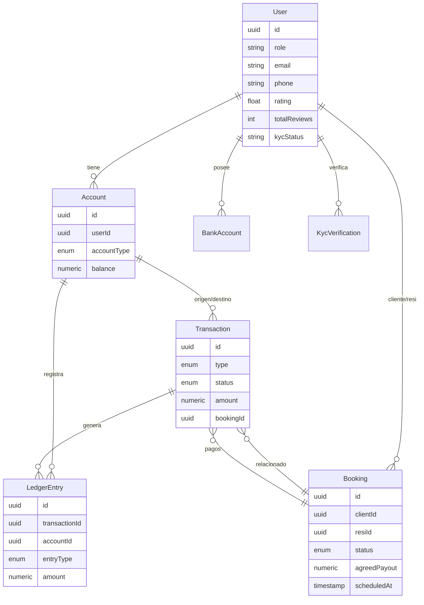

# Arquitectura de Sistemas Residenz

## 📋 Resumen Ejecutivo

Este documento analiza la arquitectura actual del sistema Residenz, compara con la arquitectura propuesta basada en agentes, y evalúa la viabilidad de implementar los 5 agentes propuestos: **Live Ops Agent**, **Gateway Agent**, **Ledger Agent**, **Saga Manager Agent**, y **Matching Agent**.

**Conclusión Principal**: ✅ **TODOS LOS AGENTES SON VIABLES** con la arquitectura actual. El sistema ya tiene las bases necesarias (eventos, double-entry ledger, state machines, Redis, BullMQ).

---

## 🏗️ Arquitectura Actual (AS-IS)

### Stack Tecnológico

| Capa | Tecnología | Versión |
|------|-----------|---------|
| **Framework** | NestJS | 10.3.3 |
| **Runtime** | Fastify | 4.x |
| **ORM** | TypeORM | 0.3.19 |
| **Base de Datos** | PostgreSQL | 15+ (Supabase) |
| **Cache** | Redis | 7+ |
| **Jobs/Queue** | BullMQ | 4.11.5 |
| **Eventos** | EventEmitter2 | 2.0.4 |
| **Auth** | JWT + Passport | - |

### Módulos Existentes

```
backend/src/modules/
├── auth/                    # Autenticación (OTP, JWT, Refresh)
├── users/                   # Gestión de usuarios
├── banking/                 # Cuentas bancarias (STUB)
├── bookings/                # ✅ Reservas (COMPLETO)
│   ├── services/
│   │   ├── booking.service.ts      # State machine + eventos
│   │   └── matching.service.ts     # Matching básico por rating
│   └── repositories/
├── payments/                # ✅ Pagos (STUB - solo módulo vacío)
├── kyc/                     # ✅ Verificación KYC (MetaMap + Prometeo)
├── chat/                    # Chat WebSocket (STUB)
├── notifications/           # Notificaciones (STUB)
└── workers/                 # BullMQ processors (STUB)
```

### Entidades de Base de Datos (9 Core)



### Patrones Arquitectónicos Implementados

1. **✅ Event-Driven Architecture**
   - `EventEmitter2` configurado globalmente
   - Eventos: `booking.created`, `booking.confirmed`, `booking.completed`, etc.
   - Ejemplo:
     ```typescript
     this.eventEmitter.emit('booking.completed', {
       bookingId: updated.id,
       resiId: updated.resiId,
       clientId: updated.clientId,
       agreedPayout: updated.agreedPayout,
     });
     ```

2. **✅ Double-Entry Ledger**
   - Entidad `LedgerEntry` con `DEBIT` y `CREDIT`
   - Invariante: `SUM(DEBIT) = SUM(CREDIT)` por transacción
   - Relación: `Transaction` → `LedgerEntry[]`

3. **✅ State Machine (Booking Lifecycle)**
   - Estados: `PENDING → CONFIRMED → IN_PROGRESS → COMPLETED`
   - Validación de transiciones en `BookingRepository`
   - Métodos: `confirmBooking()`, `startBooking()`, `completeBooking()`

4. **✅ Repository Pattern**
   - Abstracción de acceso a datos
   - Ejemplo: `BookingRepository`, `UserRepository`

5. **✅ Dependency Injection**
   - NestJS built-in DI container
   - Servicios inyectables con `@Injectable()`

6. **⚠️ CQRS Light** (Mencionado pero no implementado completamente)

---

## 🎯 Arquitectura Propuesta (TO-BE): Agentes

### A-01: Live Ops Agent (El Vigía)

**Responsabilidades**:
- Tracking de estado de servicios en tiempo real
- Gestión de ciclo de vida (check-in, check-out)
- Detección de anomalías

**Viabilidad**: ✅ **ALTA**

**Justificación**:
- ✅ Ya existe `BookingService` con métodos `startBooking()` y `completeBooking()`
- ✅ Eventos `booking.started` y `booking.completed` ya emitidos
- ✅ Campos `checkInAt` y `checkOutAt` en `Booking` entity
- ✅ Redis disponible para tracking en tiempo real

**Implementación Sugerida**:
```typescript
// backend/src/modules/live-ops/services/live-ops.service.ts
@Injectable()
export class LiveOpsService {
  @OnEvent('booking.started')
  async handleBookingStarted(payload: BookingStartedEvent) {
    // Iniciar tracking en Redis
    await this.redis.set(`live:booking:${payload.bookingId}`, {
      status: 'IN_PROGRESS',
      startedAt: new Date(),
      resiId: payload.resiId,
    });
    
    // Programar check de timeout (ej: 4 horas)
    await this.queue.add('check-timeout', { bookingId: payload.bookingId }, {
      delay: 4 * 60 * 60 * 1000,
    });
  }
}
```

**Esfuerzo Estimado**: 2-3 días

---

### A-02: Saga Manager Agent (El Coordinador)

**Responsabilidades**:
- Orquestar workflows complejos multi-dominio
- Lógica de compensación en fallos
- Ejemplo: `CreateBooking` saga (validar KYC → encontrar Resi → crear booking → autorizar pago)

**Viabilidad**: ✅ **ALTA**

**Justificación**:
- ✅ EventEmitter2 permite orquestación de eventos
- ✅ BullMQ para workflows asíncronos
- ✅ Ya existe lógica de compensación básica (ej: `cancelBooking()`)

**Implementación Sugerida**:
```typescript
// backend/src/modules/saga/services/booking-saga.service.ts
@Injectable()
export class BookingSagaService {
  async executeCreateBookingSaga(dto: CreateBookingDto) {
    const sagaId = uuid();
    const steps = [];
    
    try {
      // Step 1: Validar KYC
      const kycValid = await this.kycService.validateKyc(dto.clientId);
      steps.push({ step: 'kyc', status: 'SUCCESS' });
      
      // Step 2: Encontrar Resi
      const resi = await this.matchingService.findBestResi(dto.addressId);
      steps.push({ step: 'matching', status: 'SUCCESS' });
      
      // Step 3: Crear Booking
      const booking = await this.bookingService.createBooking(dto);
      steps.push({ step: 'booking', status: 'SUCCESS' });
      
      // Step 4: Autorizar Pago
      const payment = await this.gatewayService.authorizePayment(booking.id);
      steps.push({ step: 'payment', status: 'SUCCESS' });
      
      return { sagaId, booking, steps };
    } catch (error) {
      // Compensación: revertir pasos ejecutados
      await this.compensate(sagaId, steps);
      throw error;
    }
  }
  
  private async compensate(sagaId: string, steps: SagaStep[]) {
    for (const step of steps.reverse()) {
      if (step.step === 'booking') {
        await this.bookingService.cancelBooking(step.bookingId);
      }
      if (step.step === 'payment') {
        await this.gatewayService.voidAuthorization(step.paymentId);
      }
    }
  }
}
```

**Esfuerzo Estimado**: 3-5 días

---

### A-03: Ledger Agent (El Contador)

**Responsabilidades**:
- Procesar eventos financieros (`PAYMENT_AUTHORIZED`, `PAYOUT_INITIATED`)
- Generar entradas de ledger (double-entry)
- Emitir eventos (`LEDGER_ENTRY_RECORDED`, `INSUFFICIENT_FUNDS`)

**Viabilidad**: ✅ **MUY ALTA**

**Justificación**:
- ✅ Entidad `LedgerEntry` ya implementada con `DEBIT`/`CREDIT`
- ✅ Entidad `Transaction` con estados y relaciones
- ✅ Entidad `Account` con `balance`
- ✅ EventEmitter2 para eventos financieros

**Implementación Sugerida**:
```typescript
// backend/src/modules/banking/services/ledger.service.ts
@Injectable()
export class LedgerService {
  @OnEvent('payment.authorized')
  async handlePaymentAuthorized(event: PaymentAuthorizedEvent) {
    const { bookingId, amount, clientAccountId, escrowAccountId } = event;
    
    // Crear transacción
    const transaction = await this.transactionRepo.create({
      type: TransactionType.DEPOSIT,
      status: TransactionStatus.PENDING,
      sourceAccountId: clientAccountId,
      destinationAccountId: escrowAccountId,
      amount,
      bookingId,
    });
    
    // Crear entradas de ledger (double-entry)
    await this.ledgerRepo.create([
      {
        transactionId: transaction.id,
        accountId: clientAccountId,
        entryType: LedgerEntryType.DEBIT,
        amount,
        description: `Pago booking ${bookingId}`,
      },
      {
        transactionId: transaction.id,
        accountId: escrowAccountId,
        entryType: LedgerEntryType.CREDIT,
        amount,
        description: `Escrow booking ${bookingId}`,
      },
    ]);
    
    // Actualizar balances
    await this.accountRepo.decrement(clientAccountId, amount);
    await this.accountRepo.increment(escrowAccountId, amount);
    
    // Marcar transacción como settled
    await this.transactionRepo.update(transaction.id, {
      status: TransactionStatus.SETTLED,
    });
    
    // Emitir evento
    this.eventEmitter.emit('ledger.entry_recorded', {
      transactionId: transaction.id,
      bookingId,
    });
  }
}
```

**Esfuerzo Estimado**: 2-3 días

---

### A-04: Gateway Agent (El Cajero)

**Responsabilidades**:
- Tokenización de tarjetas (PCI DSS)
- Ejecución de cargos y capturas (Stripe)
- Manejo de webhooks bancarios
- Idempotency keys para evitar cobros dobles

**Viabilidad**: ✅ **ALTA**

**Justificación**:
- ✅ Stripe SDK ya instalado (`stripe: ^14.8.0`)
- ✅ Configuración de Stripe en `stripeConfig`
- ✅ Redis disponible para idempotency keys
- ✅ Módulo `payments/` existe (vacío, listo para implementar)

**Implementación Sugerida**:
```typescript
// backend/src/modules/payments/services/stripe.service.ts
@Injectable()
export class StripeService {
  private stripe: Stripe;
  
  constructor(private configService: ConfigService) {
    this.stripe = new Stripe(configService.get('stripe.apiKey'), {
      apiVersion: '2023-10-16',
    });
  }
  
  async createPaymentIntent(amount: number, currency: string, metadata: any) {
    return await this.stripe.paymentIntents.create({
      amount: amount * 100, // Convertir a centavos
      currency,
      metadata,
    });
  }
  
  async capturePayment(paymentIntentId: string) {
    return await this.stripe.paymentIntents.capture(paymentIntentId);
  }
}

// backend/src/modules/payments/guards/idempotency.guard.ts
@Injectable()
export class IdempotencyGuard implements CanActivate {
  constructor(private redis: Redis) {}
  
  async canActivate(context: ExecutionContext): Promise<boolean> {
    const request = context.switchToHttp().getRequest();
    const idempotencyKey = request.headers['idempotency-key'];
    
    if (!idempotencyKey) {
      throw new BadRequestException('Idempotency-Key header required');
    }
    
    const exists = await this.redis.get(`idempotency:${idempotencyKey}`);
    if (exists) {
      throw new ConflictException('Request already processed');
    }
    
    // Guardar por 24 horas
    await this.redis.set(`idempotency:${idempotencyKey}`, '1', 'EX', 86400);
    return true;
  }
}
```

**Esfuerzo Estimado**: 3-4 días

---

### A-05: Matching Agent (El Buscador)

**Responsabilidades**:
- Conectar trabajadores disponibles con demanda
- Indexación geoespacial (S2/H3)
- Algoritmo de asignación (Round Robin ponderado, Proximidad)

**Viabilidad**: ⚠️ **MEDIA-ALTA**

**Justificación**:
- ✅ Ya existe `MatchingService` con lógica básica (rating, reviews)
- ⚠️ **NO** hay indexación geoespacial (PostGIS no configurado)
- ⚠️ **NO** hay campos de latitud/longitud en `User` entity
- ✅ Algoritmo de ranking ya implementado (`calculateCompatibilityScore`)

**Gaps Identificados**:
1. Falta PostGIS extension en PostgreSQL
2. Falta campos `latitude`, `longitude` en `User` entity
3. Falta integración con S2/H3 cells

**Implementación Sugerida**:
```typescript
// 1. Migración: Agregar campos geoespaciales
@Entity('users')
export class User {
  // ... campos existentes
  
  @Column({ type: 'float', nullable: true })
  latitude: number;
  
  @Column({ type: 'float', nullable: true })
  longitude: number;
  
  @Column({ type: 'varchar', length: 20, nullable: true })
  s2CellId: string; // Para indexación geoespacial
}

// 2. Servicio de matching geoespacial
@Injectable()
export class GeoMatchingService {
  async findNearbyResis(
    latitude: number,
    longitude: number,
    maxDistanceKm: number = 10,
  ): Promise<User[]> {
    // Opción 1: PostGIS (requiere extension)
    const query = `
      SELECT * FROM users
      WHERE role = 'RESI'
        AND ST_DWithin(
          ST_MakePoint(longitude, latitude)::geography,
          ST_MakePoint($1, $2)::geography,
          $3 * 1000
        )
      ORDER BY ST_Distance(
        ST_MakePoint(longitude, latitude)::geography,
        ST_MakePoint($1, $2)::geography
      )
      LIMIT 10
    `;
    
    // Opción 2: Haversine (sin PostGIS, menos eficiente)
    const resis = await this.userRepo.find({ where: { role: 'RESI' } });
    return resis
      .map(resi => ({
        ...resi,
        distance: this.calculateDistance(latitude, longitude, resi.latitude, resi.longitude),
      }))
      .filter(r => r.distance <= maxDistanceKm)
      .sort((a, b) => a.distance - b.distance)
      .slice(0, 10);
  }
  
  private calculateDistance(lat1: number, lon1: number, lat2: number, lon2: number): number {
    // Fórmula de Haversine
    const R = 6371; // Radio de la Tierra en km
    const dLat = this.toRad(lat2 - lat1);
    const dLon = this.toRad(lon2 - lon1);
    const a =
      Math.sin(dLat / 2) * Math.sin(dLat / 2) +
      Math.cos(this.toRad(lat1)) *
        Math.cos(this.toRad(lat2)) *
        Math.sin(dLon / 2) *
        Math.sin(dLon / 2);
    const c = 2 * Math.atan2(Math.sqrt(a), Math.sqrt(1 - a));
    return R * c;
  }
  
  private toRad(degrees: number): number {
    return degrees * (Math.PI / 180);
  }
}
```

**Esfuerzo Estimado**: 4-6 días (incluye migración de DB y PostGIS setup)

---

## 📊 Comparación: Arquitectura Actual vs Propuesta

| Aspecto | Actual | Propuesta (Agentes) | Gap |
|---------|--------|---------------------|-----|
| **Eventos** | ✅ EventEmitter2 | ✅ Event-driven agents | Ninguno |
| **Ledger** | ✅ Double-entry implementado | ✅ Ledger Agent | Ninguno |
| **Matching** | ✅ Básico (rating) | ⚠️ Geoespacial (S2/H3) | PostGIS, lat/lon |
| **Pagos** | ⚠️ Módulo vacío | ✅ Gateway Agent | Implementación completa |
| **Sagas** | ❌ No existe | ✅ Saga Manager | Implementación completa |
| **Live Ops** | ⚠️ Parcial (check-in/out) | ✅ Live Ops Agent | Tracking en Redis |
| **Idempotency** | ❌ No existe | ✅ Idempotency Guard | Implementación |
| **Webhooks** | ⚠️ Solo KYC | ✅ Stripe webhooks | Implementación |

---

## ✅ Viabilidad de los Agentes Propuestos

### Resumen de Viabilidad

| Agente | Viabilidad | Esfuerzo | Prioridad | Bloqueadores |
|--------|-----------|----------|-----------|--------------|
| **Gateway Agent** | ✅ Alta | 3-4 días | 🔴 Crítica | Ninguno |
| **Ledger Agent** | ✅ Muy Alta | 2-3 días | 🔴 Crítica | Ninguno |
| **Live Ops Agent** | ✅ Alta | 2-3 días | 🟡 Media | Ninguno |
| **Saga Manager** | ✅ Alta | 3-5 días | 🟡 Media | Ninguno |
| **Matching Agent** | ⚠️ Media-Alta | 4-6 días | 🟢 Baja | PostGIS, migración DB |

### Recomendaciones de Implementación

**Fase 1: Core Financiero (Semana 1-2)**
1. ✅ **Gateway Agent** - Crítico para pagos
2. ✅ **Ledger Agent** - Crítico para contabilidad

**Fase 2: Orquestación (Semana 3)**
3. ✅ **Saga Manager Agent** - Importante para workflows complejos
4. ✅ **Live Ops Agent** - Importante para tracking

**Fase 3: Optimización (Semana 4+)**
5. ⚠️ **Matching Agent** (Geoespacial) - Mejora sobre matching actual

---

## 🚀 Plan de Migración

### Estrategia: **Incremental y No-Disruptiva**

1. **Mantener código actual funcionando**
2. **Agregar agentes como nuevos módulos**
3. **Migrar funcionalidad gradualmente**
4. **Deprecar código viejo solo cuando agentes estén probados**

### Ejemplo: Migración de Matching

```typescript
// ANTES (actual)
// backend/src/modules/bookings/services/matching.service.ts
@Injectable()
export class MatchingService {
  async findBestResi(addressId: string, scheduledAt: Date): Promise<User | null> {
    // Lógica actual (rating-based)
  }
}

// DESPUÉS (con agente)
// backend/src/modules/matching/services/matching-agent.service.ts
@Injectable()
export class MatchingAgentService {
  constructor(
    private legacyMatchingService: MatchingService, // Mantener legacy
    private geoMatchingService: GeoMatchingService, // Nuevo
  ) {}
  
  async findBestResi(addressId: string, scheduledAt: Date): Promise<User | null> {
    // Feature flag para A/B testing
    const useGeoMatching = await this.configService.get('FEATURE_GEO_MATCHING');
    
    if (useGeoMatching) {
      return await this.geoMatchingService.findNearbyResis(lat, lon);
    } else {
      return await this.legacyMatchingService.findBestResi(addressId, scheduledAt);
    }
  }
}
```

---

## 🎯 Conclusiones

### ✅ Todos los Agentes son Viables

La arquitectura actual de Residenz **ya tiene las bases necesarias** para implementar los 5 agentes propuestos:

1. ✅ **EventEmitter2** para comunicación entre agentes
2. ✅ **BullMQ** para procesamiento asíncrono
3. ✅ **Redis** para cache e idempotency
4. ✅ **Double-entry ledger** ya implementado
5. ✅ **State machines** en Bookings
6. ✅ **Stripe SDK** instalado

### 🚧 Gaps Menores Identificados

1. **Matching Agent**: Requiere PostGIS y campos geoespaciales
2. **Gateway Agent**: Requiere implementación completa (módulo vacío)
3. **Saga Manager**: Requiere implementación completa (no existe)
4. **Idempotency**: Requiere guard con Redis

### 📅 Timeline Estimado

- **Fase 1 (Gateway + Ledger)**: 5-7 días
- **Fase 2 (Saga + Live Ops)**: 5-8 días
- **Fase 3 (Matching Geo)**: 4-6 días

**Total**: 14-21 días (2-3 semanas) para implementar todos los agentes.

### 🎖️ Recomendación Final

**Proceder con la implementación de los agentes en el orden propuesto**, comenzando por Gateway y Ledger (críticos para el core financiero), seguido por Saga Manager y Live Ops, y finalmente Matching geoespacial como mejora.

La arquitectura actual es **sólida y extensible**, y los agentes propuestos se integran **naturalmente** sin requerir refactorización mayor.